# Corne miniEC Build Guide

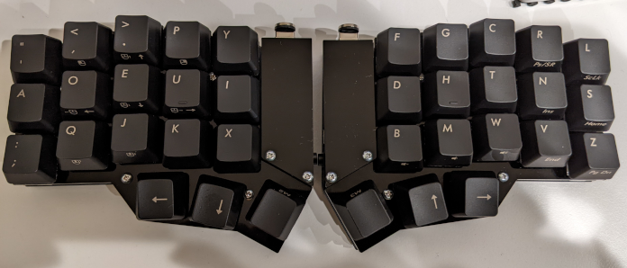

## 部品
### 必要なもの

| 品目                                            | 数量 | 備考                                                                                                                                                                                                                                                  |
|-------------------------------------------------|------|-------------------------------------------------------------------------------------------------------------------------------------------------------------------------------------------------------------------------------------------------------|
| PCB                                             |    左右用 |                                                                                                                                                                                                                                                       |
| アクリルプレート                                |  左右用 | corne mini 用のアクリルプレートを購入してください<br>https://shop.yushakobo.jp/products/keyboard_acrylic_plate?variant=37715871236257                                                                                                                                                                      |
| TRRS ジャック                                   |    2 | https://akizukidenshi.com/catalog/g/gC-06070/                                                                                                                                                                                                         |
| タクトスイッチ(オプション)                      |    2 | 原理上はなくてもよいです<br>https://akizukidenshi.com/catalog/g/gP-08073/                                                                                                                                                                                                         |
| 7pin socket                                     |    4 | https://www.hirosugi-net.co.jp/shop/g/g24084/                                                                                                                                                                                                         |
| ハーフピッチ 16pin ソケット |    2 | 16ピン用は売っていないので20ピン用をカットして使います<br> https://www.hirosugi-net.co.jp/shop/g/g18851/                                                                                                                                                                                                         |
| m2 8.5mm スペーサー                             |   10 | https://www.hirosugi-net.co.jp/shop/g/g2395/                                                                                                                                                                                                          |
| m2 10mm スペーサー                              |    4 | https://www.hirosugi-net.co.jp/shop/g/g2398/                                                                                                                                                                                                          |
| m5 2mm スペーサー                               |   10 | https://www.hirosugi-net.co.jp/shop/g/g3318/                                                                                                                                                                                                          |
| m2 4mm 低頭ねじ                                     |   10 | https://wilco.jp/products/F/FX-E.html#page3                                                                                                                                                                                                         |
| m2 4mm ねじ                                     |   18 | https://www.hirosugi-net.co.jp/shop/g/g36905/                                                                                                                                                                                                         |
| ゴム足                                          |    8 | https://www.amazon.co.jp/dp/B08WYNYLSK                                                                                                                                                                                                                |
| 静電容量スイッチスキャン用モジュール            |    2 | https://nogikes.booth.pm/items/2710697                                                                                                                                                                                                                |
| Seeed Studio XIAO RP2040                        |    2 | - https://akizukidenshi.com/catalog/g/gM-17044/ <br>- https://talpkeyboard.net/items/63534f58f5197322fceb6487 <br>- https://www.switch-science.com/products/7634?gclid=Cj0KCQiAn4SeBhCwARIsANeF9DKmqjOd5mDyTjdRjlI8Az9yD6eNxgfJHfWghG-0v4dwvCrwWmRG_JkaAuxmEALw_wcB |
| NEW NIZ EC SWITCH                               |   36キー分 | https://shop.yushakobo.jp/products/5224?_pos=1&_sid=e5c84c034&_ss=r                                                                                                                                                                                   |
| コニカルスプリング                              |   36キー分 | https://shop.yushakobo.jp/products/4679?_pos=2&_sid=e5c84c034&_ss=r                                                                                                                                                                                   |
| ラバーシート                                    |    36キー分 | https://shop.yushakobo.jp/products/a0500er-01-1?_pos=1&_sid=2c4c76839&_ss=r                                                                                                                                                                           |
| キーキャップ                                    |   36キー分 | MX 互換のもの                                                                                                                                                                                                                                         |
| TRRSケーブル                                    |    1 | https://shop.yushakobo.jp/products/trrs_cable?_pos=2&_sid=739f146d9&_ss=r                                                                                                                                                                             |


## 実装

写真のように置いたときの向きが左右の表面です。

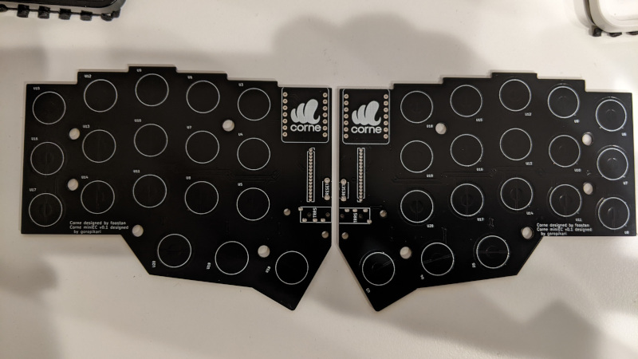


### ハンダ付け
写真のようにピンソケット、TRRS ジャック、タクトスイッチを置きハンダ付けします。

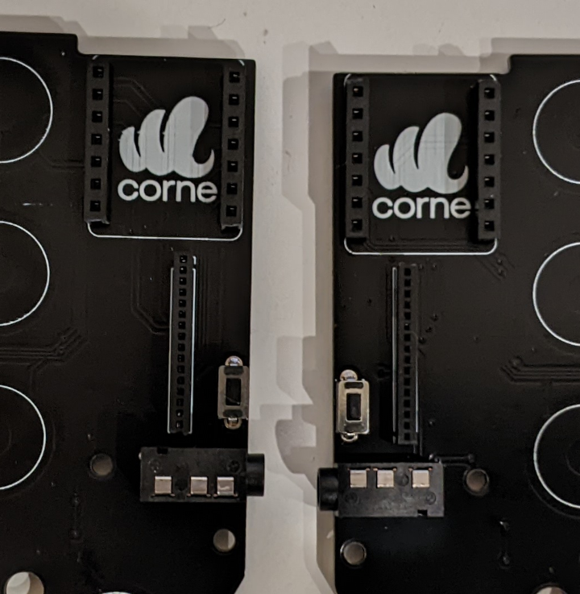


マイコン、静電容量スキャンモジュールにピンヘッダーをハンダ付けし、下記の写真のような向きで配置します。


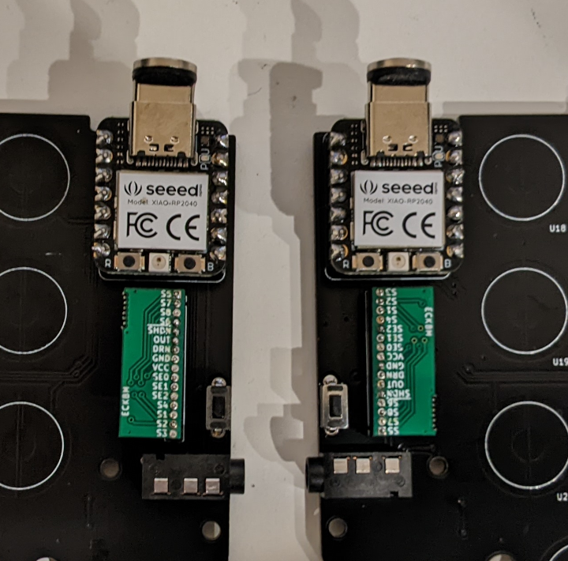


### スイッチ

トッププレートに M2 8.5 mm スペーサーを低頭ネジで固定します。低頭ネジでない普通のネジで止めるとキーを押したときにネジの頭とキーキャップが衝突します。

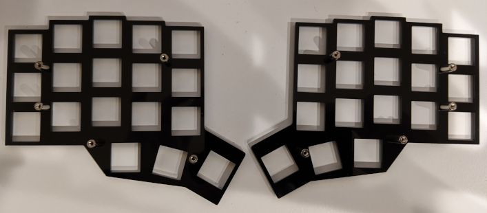

次にハウジングをトッププレートにハメていきます。このときハウジングとスペーサーが干渉してハウジングがハメられない箇所が何箇所かあります。その部分ではハウジングの干渉している部分をニッパーなどを使って切り落としてください。


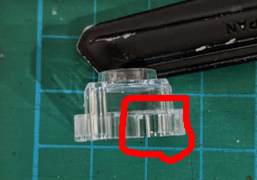


ハウジングをハメたらプランジャーをハウジングに入れていきます。プランジャーはハウジングのレールに沿うように入れてください。

正しい向き<br>


間違った向き<br>


ラバーシートを切り出しハウジングにかぶせ、コニカルスプリングを配置します。

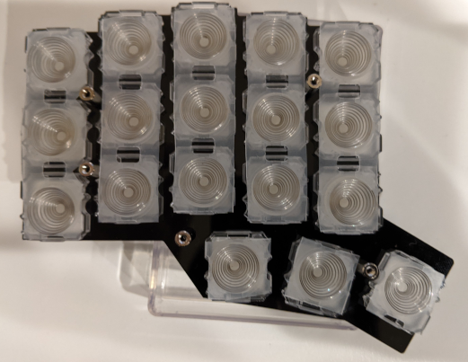


### マイコンカバー用スペーサー

あとでマイコンカバーをつけるための M2 10 mm スペーサーをネジで止めます。このときまだマイコンカバーはつけないでください。

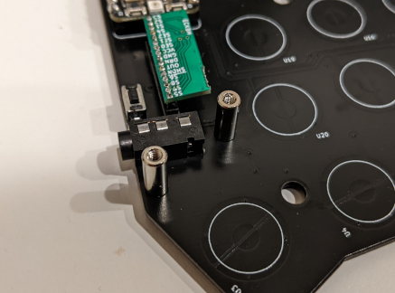


### メイン基板・ボトムプレート・ゴム足

メイン基板を乗せ、スペーサーのところに M5 2 mm スペーサーをおいてください。
最後にボトムプレートをかぶせネジで止め、ゴム足を貼り付けてください。

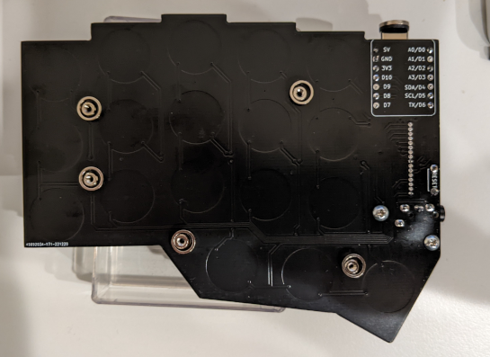

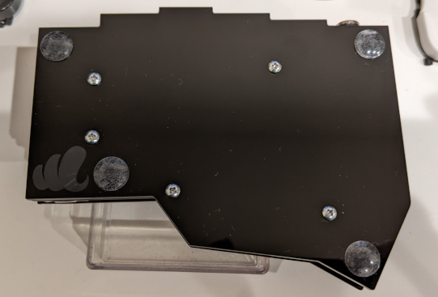


## Firmware

XIAO RP2040 用の CircuitPython を[ダウンロード](https://circuitpython.org/board/seeeduino_xiao_rp2040/)します。
(動作確認は [version 7.3.3](https://adafruit-circuit-python.s3.amazonaws.com/bin/seeeduino_xiao_rp2040/en_US/adafruit-circuitpython-seeeduino_xiao_rp2040-en_US-7.3.3.uf2) で行いました。)

bootloader mode で起動し、ダウンロードした `uf2` ファイルをコピーします。手順は公式 doc を参照してください。bootloader mode に起動するときだけマイコンのスイッチを押す必要がありますが、これ以降はマイコンのスイッチを押す必要はないためこの作業が終わったらマイコンカバーをつけてよいです。
- https://wiki.seeedstudio.com/XIAO-RP2040/#enter-bootloader-mode
- https://learn.adafruit.com/welcome-to-circuitpython/installing-circuitpython#bootloader-mode-3105160

コピーし終わると `CIRCUITPY` というドライブがマウントされます。
後のためにドライブ名を左手用のマイコンは `NYQUISTL`, 右手用は `NYQUISTR` にリネームしておいてください。<br>
https://learn.adafruit.com/welcome-to-circuitpython/renaming-circuitpy


次にマウントされたドライブに firmware プログラムを配置します。

```bash
git clone --recursive https://github.com/goropikari/CorneMiniEC
```

`kmk_firmware` 配下の kmk ディレクトリをドライブ直下に配置、`fm` ディレクトリ配下の Python プログラムをドライブ直下に配置します。

全てのファイルを配置したあとは以下のようなディレクトリ構成になります。

```bash
.
├── boot.py
├── code.py
├── kmk/
└── scanner.py
```

両手のマイコンに配置したら一度 USB ケーブルを抜き再度接続してください。このときはストレージとしてマウントされません。USB ケーブルは左右どちらに接続しても構いません。
タイピングしてみてキーが入力されたら成功です。


### キーマップ変更

タクトスイッチを押しながら USB ケーブルをつなぐとストレージとして認識されます。`code.py` を修正してお好みのキーマップにしてください。

### 閾値調整


`code.py` で `debug=False` になっている部分を `True` に、`boot.py` の「debug するときは下2行をコメントアウトする」と書かれている2行をコメントアウトし、USB ケーブルを抜き差しすると各スイッチの電圧が出力されるようになります。

出力は [picocom](https://wiki.archlinux.jp/index.php/%E3%82%B7%E3%83%AA%E3%82%A2%E3%83%AB%E3%82%B3%E3%83%B3%E3%82%BD%E3%83%BC%E3%83%AB#picocom) や [Mu editor](https://codewith.mu/) を使うと見ることが出来ます。下図は Mu editor を使って出力値をプロットしているところです。
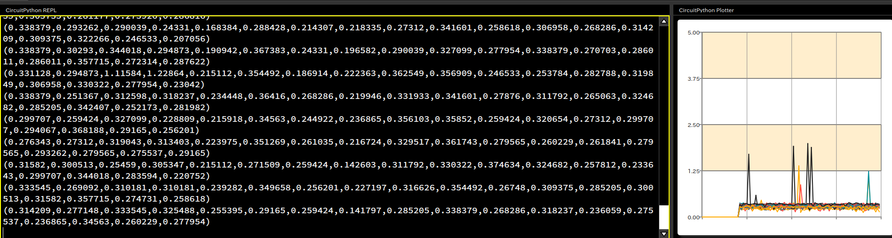

この出力値を参考に閾値を調節してください。初期値は下記のように設定されています。

```python
low_threshold=0.7,
high_threshold=0.8,
```
