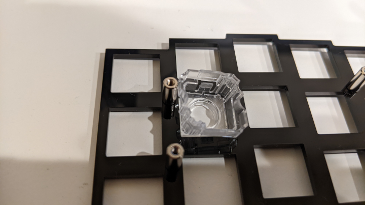
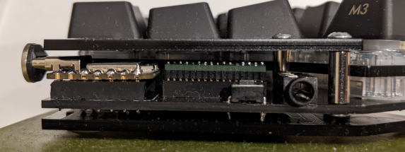

# Corne miniEC Build Guide


**Corne miniEC is made by goropikari(not by foostan, the original designer of [crkbd](https://github.com/foostan/crkbd)). Please do NOT contact foostan regarding this product.**


## 部品
### 必要なもの

| 品目                                            | 数量 | 備考                                                                                                                                                                                                                                                  |
|-------------------------------------------------|------|-------------------------------------------------------------------------------------------------------------------------------------------------------------------------------------------------------------------------------------------------------|
| PCB                                             |    左右用 | https://pikarikbd.booth.pm/items/4530773                                                                                                                                                                                                                                                       |
| アクリルプレート                                |  左右用 | corne mini 用のアクリルプレートを購入してください<br>https://shop.yushakobo.jp/products/keyboard_acrylic_plate?variant=37715871236257                                                                                                                                                                      |
| TRRS ジャック                                   |    2 | https://akizukidenshi.com/catalog/g/gC-06070/                                                                                                                                                                                                         |
| タクトスイッチ(オプション)                      |    2 | 原理上はなくてもよいです。今回の firmware では XIAO RP2040 をストレージとして認識させるか否かの制御のために使っています<br>https://akizukidenshi.com/catalog/g/gP-08073/                                                                                                                                                                                                         |
| 7pin socket(オプション)                                     |    4 | マイコンを取り外し可能にする場合のみ必要です<br>https://www.hirosugi-net.co.jp/shop/g/g24084/                                                                                                                                                                                                         |
| ハーフピッチ 16pin ソケット(オプション) |    2 | 静電容量スイッチスキャン用モジュールを取り外し可能にする場合のみ必要です。16ピン用は売っていないので20ピン用をカットして使います<br> https://www.hirosugi-net.co.jp/shop/g/g18851/                                                                                                                                                                                                         |
| M2 8.5mm スペーサー                             |   10 | https://www.hirosugi-net.co.jp/shop/g/g2395/                                                                                                                                                                                                          |
| M2 10mm スペーサー                              |    4 | マイコンカバー用。マイコン部分をどのようにはんだ付けするかによって最適な高さは変わります。「[マイコンカバー用スペーサー](#マイコンカバー用スペーサー)」にどれくらいの隙間ができるのかの写真を貼ってありますので参考にしてください。<br>https://www.hirosugi-net.co.jp/shop/g/g2398/                                                                                                                                                                                                          |
| M5 2mm スペーサー                               |   10 | https://www.hirosugi-net.co.jp/shop/g/g3318/                                                                                                                                                                                                          |
| M2 4 mm 低頭ねじ                                     |   10 | https://wilco.jp/products/F/FX-E.html#page3                                                                                                                                                                                                         |
| M2 4 mm ねじ                                     |   18 | M2 4 mm ネジは全て低頭ネジにしても構いません<br>https://www.hirosugi-net.co.jp/shop/g/g36905/                                                                                                                                                                                                         |
| ゴム足                                          |    8 | https://www.amazon.co.jp/dp/B08WYNYLSK                                                                                                                                                                                                                |
| 静電容量スイッチスキャン用モジュール            |    2 | 2023/1/20 時点ではハーフピッチピンヘッダーもつけていただけていますが、もしつかなくなっていたら別途購入してください<br>https://nogikes.booth.pm/items/2710697                                                                                                                                                                                                                |
| Seeed Studio XIAO RP2040                        |    2 | - https://akizukidenshi.com/catalog/g/gM-17044/ <br>- https://talpkeyboard.net/items/63534f58f5197322fceb6487 <br>- https://www.switch-science.com/products/7634?gclid=Cj0KCQiAn4SeBhCwARIsANeF9DKmqjOd5mDyTjdRjlI8Az9yD6eNxgfJHfWghG-0v4dwvCrwWmRG_JkaAuxmEALw_wcB |
| NEW NIZ EC SWITCH                               |   36キー分 | https://shop.yushakobo.jp/products/5224?_pos=1&_sid=e5c84c034&_ss=r                                                                                                                                                                                   |
| コニカルスプリング                              |   36キー分 | https://shop.yushakobo.jp/products/4679?_pos=2&_sid=e5c84c034&_ss=r                                                                                                                                                                                   |
| ラバーシート                                    |    36キー分 | https://shop.yushakobo.jp/products/a0500er-01-1?_pos=1&_sid=2c4c76839&_ss=r                                                                                                                                                                           |
| キーキャップ                                    |   36キー分 | MX 互換のもの。イメージ写真で使っているものは [Majestouch Xacro 交換用キーキャップです](https://www.diatec.co.jp/shop/det.php?prod_c=6242)                                                                                                                                                                                                                                         |
| TRRSケーブル                                    |    1 | https://shop.yushakobo.jp/products/trrs_cable?_pos=2&_sid=739f146d9&_ss=r                                                                                                                                                                             |


## 実装

写真のように置いたときの向きが左右の表面です。


### ハンダ付け
写真のようにピンソケット、タクトスイッチ、TRRS ジャックを置きハンダ付けします。


マイコン、静電容量スキャンモジュールにピンヘッダーをハンダ付けし、下記の写真のような向きで配置します。


### スイッチ

トッププレートに M2 8.5 mm スペーサーを低頭ネジで固定します。低頭ネジでない普通のネジで止めるとキーを押したときにネジの頭とキーキャップが衝突することがあります。


次にハウジングをトッププレートにハメていきます。このときハウジングとスペーサーが干渉してハウジングがハメられない箇所が何箇所かあります。その部分ではハウジングの干渉している部分をニッパーなどを使って切り落としてください。




ハウジングをハメたらプランジャーをハウジングに入れていきます。プランジャーはハウジングのレールに沿うように入れてください。

正しい向き<br>


間違った向き<br>


ラバーシートを切り出しハウジングにかぶせ、コニカルスプリングを配置します。


(余談) ラバーシートの側面に穴を開けると打鍵が軽くなります。一方でタクタイル感が減りリニアに違い打鍵感になります。写真では直径 3 mm の穴を1キーあたり4つ開けています。


### マイコンカバー用スペーサー

マイコンカバーをつけるための M2 10 mm スペーサーをネジで止めます。このときまだマイコンカバーはつけないでください。


ちなみに 10 mm スペーサーを使用した場合のマイコンとアクリルプレートの距離はこのような感じです。マイコンはピンヘッダーのプラスチックを取ることで高さを抑えています。



### メイン基板・ボトムプレート・ゴム足

メイン基板を乗せ、スペーサーのところに M5 2 mm スペーサーをおいてください。
最後にボトムプレートをかぶせネジで止め、ゴム足を貼り付けてください。


## Firmware

XIAO RP2040 用の CircuitPython を[ダウンロード](https://circuitpython.org/board/seeeduino_xiao_rp2040/)します。
(動作確認は [version 8.0.0](https://adafruit-circuit-python.s3.amazonaws.com/bin/seeeduino_xiao_rp2040/en_US/adafruit-circuitpython-seeeduino_xiao_rp2040-en_US-8.0.0.uf2) で行いました。)

bootloader mode で起動し、ダウンロードした `uf2` ファイルをコピーします。手順は公式 doc を参照してください。bootloader mode に起動するときだけマイコンのスイッチを押す必要がありますが、これ以降はマイコンのスイッチを押す必要はないためこの作業が終わったらマイコンカバーをつけてよいです。
- bootloader mode への入り方
  - https://wiki.seeedstudio.com/XIAO-RP2040/#enter-bootloader-mode
- circuit python インストール方法
  - https://learn.adafruit.com/welcome-to-circuitpython/installing-circuitpython#bootloader-mode-3105160

コピーし終わると `CIRCUITPY` という名前でストレージがマウントされます。
後のためにストレージ名を左手用のマイコンは `NYQUISTL`, 右手用は `NYQUISTR` にリネームしておいてください。リネームを行わないと分割キーボードとして機能しなくなります。
- リネームの仕方
  - https://learn.adafruit.com/welcome-to-circuitpython/renaming-circuitpy


次にマウントされたストレージに firmware プログラムを配置します。

```bash
git clone --recursive https://github.com/goropikari/CorneMiniEC
```

`kmk_firmware` ディレクトリ配下の kmk ディレクトリをまるごとストレージ直下に配置、`firmware` ディレクトリ配下の Python プログラムをストレージ直下に配置します。

全てのファイルを配置したあとは以下のようなディレクトリ構成になります。

```bash
.
├── boot.py
├── code.py
├── kmk/
├── scanner.py
└── settings.toml
```

両手のマイコンに配置したら一度 USB ケーブルを抜き再度接続してください。このときはストレージとしてマウントされません。USB ケーブルは左右どちらに接続しても構いません。
タイピングしてみてキーが入力されたら成功です。デフォルトのキーマップは Dvorak 配列です。


### キーマップ変更

USB ケーブルを抜き、タクトスイッチを押しながら USB ケーブルをつなぐと再びストレージとして認識されます。`code.py` を修正してお好みのキーマップにしてください。

### 閾値調整


`settings.py` で `DEBUG=0` になっている部分を `DEBUG=1` にし、USB ケーブルを抜き差しすると各スイッチの電圧が出力されるようになります。このときはキーを押しても何も入力されません。

出力は [picocom](https://wiki.archlinux.jp/index.php/%E3%82%B7%E3%83%AA%E3%82%A2%E3%83%AB%E3%82%B3%E3%83%B3%E3%82%BD%E3%83%BC%E3%83%AB#picocom) や [Mu editor](https://codewith.mu/) を使うと見ることが出来ます。下図は Mu editor を使って出力値をプロットしているところです。


この出力値を参考に閾値を調節してください。初期値は下記のように設定されています。

```python
low_threshold=0.6,
high_threshold=0.7,
```

ここで `high_threshold`, `low_threshold` は [tomsmalley/custom-topre-guide](https://github.com/tomsmalley/custom-topre-guide/blob/c4a8cadadc9f8ab422d9cba28a28701198a1bd22/README.md#overview) における Actuation Depth, Release Depth にそれぞれ対応します。
簡単に言うとある電圧(high_threshold)よりも上ならばキーが押された、ある電圧(low_threshold)よりも下ならばキーが押されていないと判定しています。


## firmware をバグらせたら

キーマップやその他設定をいじっているとバグらせてしまうことが多々あります。その結果コードの書き換えが一切出来ない状態になることがあります。そのようなときは下記の記事を参考にマイコンを初期状態にリセットしてみてください。

https://zenn.dev/link/comments/c6600bde683fe6
